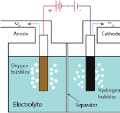
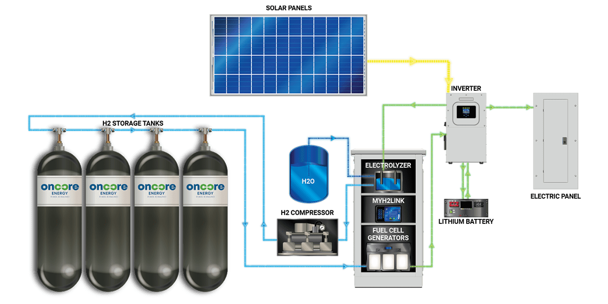

<h1>Hydrogen Energy</h1>

<h3>This is a read me file for the H2 generator project</h3>

Building a <b>Hydrogen generator</b> to produce hydrogen in order to mitigate the daily need of energy for people in a green way.

In this project we will build an automated Hydrogen generator that will extract <b>Hydrogen(H2)</b> and <b>Oxygen(O2)</b> from water(H2O).

<b>This is made possible by the process called Electrolysis</b>

<h2>This is how the generator will be built</h2>

<ul>
    <li>To separate the two molecules that make up water (<strong>Hydrogen</strong> and <strong>Oxygen</strong>) in a green way, we need a power supply that does not release carbon to the atmosphere. Using <b>Solar Power</b> is the most basic and simplest way.</li>
    <li>The second phase is to store the two gases to their respective containers.</li>
    <li>A Fuel cell will be installed to generate power by fusing the two molecules back in to water. The same water can be used to generate energy again.</li>
</ul>

<h4>The generator is an autonomous machine. This means that ones installed and in operation process, in proceeds operating on its own.</h4>

This is made possible by installing a micro controller chip like Raspberry Pi etc, to control every function of the generator. Programming language that will be used is <b>python</b> and c++.

<h2 style="text-align: center">...Still in working process...</h2>